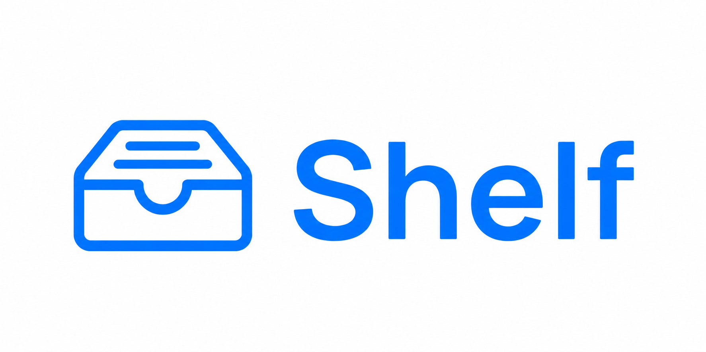

# Shelf



Shelf is a small native macOS app for saving links, files, and quick notes for later. Drop something in, keep moving, and come back when you actually need it.

[](https://github.com/dudeactual/Shelf/releases/latest)
[](https://discord.gg/kpaZC6YPWZ)

## What Shelf does

- Saves web links as normal `.txt` files
- Copies dropped files into your Shelf folder
- Saves dropped text as notes
- Lets you pin important items
- Lets you remove items from the Shelf list without deleting the saved file
- Includes a simple **Check for Updates** button that opens the latest release page

## Download Shelf

Download the newest version here:

[github.com/dudeactual/Shelf/releases/latest](https://github.com/dudeactual/Shelf/releases/latest)

On the release page, download the newest Shelf `.zip` or `.dmg`, open it, then move `Shelf.app` into your Applications folder.

Shelf requires macOS 14 or newer.

## Opening Shelf the first time

Shelf is currently distributed for free outside the Mac App Store. That means macOS may show a warning like:

> “Shelf” cannot be opened because the developer cannot be verified.

To open it:

1. Right-click `Shelf.app`
2. Choose **Open**
3. Click **Open** again if macOS asks

This only happens because the free build is not Apple-notarized yet. The app still stores your data locally in your own Documents folder.

## Where your saved stuff goes

Shelf saves everything in:

```text
~/Documents/Shelf
```

Inside that folder:

- Dropped files are copied as regular files
- Links are saved as `.txt` files containing the URL
- Notes are saved as `.txt` files
- `.shelf-index.json` stores display info like pinning and list order

## Updating Shelf

Inside Shelf, open **Settings** and click **Check for Updates**.

Right now, this opens the latest GitHub Release page so you can download the newest version manually. Full in-app auto-updates may come later.

## Join the community

Questions, ideas, bugs, and feature requests are welcome in the Shelf Discord:

[](https://discord.gg/kpaZC6YPWZ)

## Build locally

If you want to build Shelf from source:

```sh
./script/build_and_run.sh
```

To create a local release package:

```sh
VERSION=1.0.0 ./script/package_release.sh
```

This creates downloadable files in `releases/`.

## Maintainer release flow

To ship a new version:

```sh
git add .
git commit -m "Update Shelf"
git push
./script/ship_update.sh 1.0.1
```

GitHub Actions will build the release and attach the download files to GitHub Releases.
